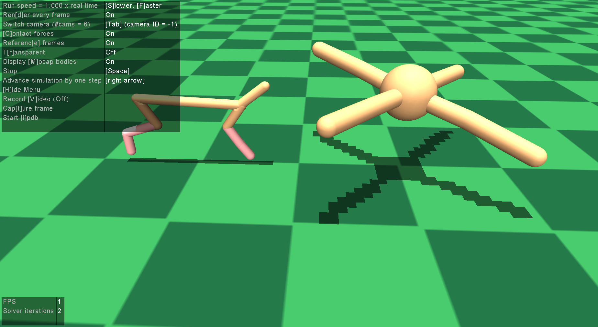

# DDRL

Disclaimer: This repository is an edited version of the original repository of Malte Schilling: https://github.com/malteschilling/ddrl

Deep Decentralized Reinforcement Learning - locally structured architecture for DRL in a continuous locomotion control task on a four-legged simulated agent.

The repository holds implementation for training a decentralized control architecture of a two-legged robot.

For further and specific details about a decentralized control architecture of a four-legged robot, we refer to the submitted article: Malte Schilling, Andrew Melnik, Frank W. Ohl, Helge Ritter, and Barbara Hammer, Decentralized Control and Local Information for Robust and Adaptive Decentralized Deep Reinforcement Learning.

For questions, please contact: Malte Schilling, mschilli@techfak.uni-bielefeld.de or Wadhah Zai El Amri: wzaielamri@techfak.uni-bielefeld.de

## Overview Repository

The repository consists of multiple parts, all written in Python:

- train_experiment_1_architecture_on_flat.py = Script for training models. The first learning experiment aims to answer the question how does different control architectures—w.r.t. decentralization of the action space and input scope of the observation space–affect learning over time. Trained on flat terrain and aiming for running as fast as possible.
- evaluation = Folder with scripts for evaluation. These scripts are running trained controller and collecting data (velocity, return, distance, cost of transport) which are saved in panda files.
- Results = Contains different result-figures from the first experiment.
- stats = calculating statistical comparisons, based on previously run evaluations.
- visualization = producing figures, based on previously run evaluations.

Run evaluation, visualization and stats scripts from the main working directory using python -O -m visualization.script_name.

Main control models and architectures are implemented in:

- models = neural network model (and Glorot initialization) used for DRL, LSTM model.
- simulation_envs = all control architectures for the first experiment, realized as RLlib multiagent environments.

## Architectures

We compare different types of controllers that vary along two major feature dimensions: First, with respect to concurrency of control—splitting the action space of the whole agent into separate subspaces with their dedicated controllers, e.g., one controller for each joint. Second, we consider the scope of varying the mass of the robot and how this can affect the overall performance of the agent for the different architectures (centralized and decentralized).

Architectures Description:

Centralized: 1 Centralized agent.

TwoSides: 2 agents fully decentralized.
AllInfo: 2 agents with all obs informations from all joints.
GCN: 2 agents with only obs informations from the corresponding leg and the previous actions of only the other leg.
TwoSidesCur: 2 agents fully decentralized. trained with curriculum training, different weights factors: (0.1, 1, 0.1) in timestamps: (250000, 2500000, 250000)

SixFullyDecentral: 6 agents fully decentralized.
neighborJoints: 6 agents with obs informations from only the corresponding leg.
neighborJointsAllInfo: 6 agents with all possible informations from all joints.
BioGraph: 6 agents with graph connections derived from biology.
SixFullyDecentralCur: 6 agents fully decentralized. trained with curriculum training, different weights factors: (0.1, 1, 0.1) in timestamps: (250000, 2500000, 250000)

## Requirements

Code is written in python (version 3.6).

As a framework for DRL we used Ray (version 1.0.1) and RLlib. Ray is a framework that allows to efficiently distribute python tasks on clusters implementing an actor model for concurrent processing. It offers an easy and unified interface for running parallel tasks which are internally modeled as a graph of dependent tasks that can be executed. RLlib as part of Ray provides a scalable and efficient DRL framework which as well is centered around these actor-based computations that simplify setting up parallel computation and encapsulation of information.

Experiments were run in simulation using the Mujoco physics engine. We used Mujoco in version 1.50.1.68

Deep neural network models were realized in tensorflow 2 (version 2.3.1)
